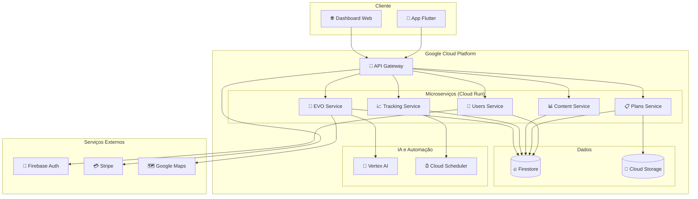

# 🏗️ ARQUITETURA DO EVOLVEYOU

## 📋 Visão Geral

O EvolveYou utiliza uma **arquitetura de microserviços** moderna, escalável e resiliente, hospedada na **Google Cloud Platform**.

---

## 🎯 Princípios Arquiteturais

### 1. **Separação de Responsabilidades**
Cada microserviço tem uma responsabilidade única e bem definida.

### 2. **Baixo Acoplamento, Alta Coesão**
Serviços independentes que podem ser desenvolvidos e deployados separadamente.

### 3. **API-First Design**
Contratos de API bem definidos permitem desenvolvimento paralelo.

### 4. **Escalabilidade Horizontal**
Cada serviço pode escalar independentemente conforme demanda.

### 5. **Resiliência e Tolerância a Falhas**
Sistema continua funcionando mesmo com falhas parciais.

---

## 🏛️ Diagrama de Arquitetura



---

## 🔧 Microserviços

### 1. **👤 Users Service**
**Responsabilidade**: Gestão de usuários, autenticação e anamnese

**APIs Principais**:
- `POST /auth/register` - Registro de usuário
- `POST /auth/login` - Login
- `POST /onboarding/submit` - Submeter anamnese
- `GET /users/me` - Perfil do usuário

**Tecnologias**: Python + FastAPI + Firebase Auth

### 2. **📋 Plans Service**
**Responsabilidade**: Geração e gestão de planos de dieta e treino

**APIs Principais**:
- `GET /plan/diet` - Plano de dieta personalizado
- `GET /plan/workout` - Plano de treino personalizado
- `GET /plan/presentation` - Apresentação do plano pelo EVO
- `POST /plan/regenerate` - Regenerar planos (ciclo 45 dias)

**Tecnologias**: Python + FastAPI + Algoritmos ML

### 3. **📊 Content Service**
**Responsabilidade**: Base de dados de alimentos (TACO) e exercícios

**APIs Principais**:
- `GET /foods/search` - Buscar alimentos
- `GET /foods/{id}` - Detalhes do alimento
- `GET /exercises` - Lista de exercícios
- `GET /exercises/{id}` - Detalhes do exercício

**Tecnologias**: Node.js + Express + Base TACO

### 4. **📈 Tracking Service**
**Responsabilidade**: Acompanhamento diário e sistema full-time

**APIs Principais**:
- `POST /log/meal` - Registrar refeição
- `POST /log/workout` - Registrar treino
- `POST /log/activity` - Atividade não prevista
- `GET /dashboard` - Dados do dashboard

**Tecnologias**: Python + FastAPI + Algoritmos de Rebalanceamento

### 5. **🤖 EVO Service**
**Responsabilidade**: Coach virtual, IA e funcionalidades premium

**APIs Principais**:
- `POST /evo/chat` - Conversar com EVO
- `POST /evo/analyze-photo` - Análise corporal
- `GET /evo/motivation` - Mensagens motivacionais
- `POST /evo/guidance` - Orientações personalizadas

**Tecnologias**: Python + FastAPI + Vertex AI

### 6. **🚪 Gateway Service**
**Responsabilidade**: Roteamento, autenticação e controle de acesso

**Funcionalidades**:
- Roteamento inteligente
- Autenticação centralizada
- Rate limiting
- Logs e métricas
- Controle de acesso premium

**Tecnologias**: Node.js + Express + JWT

---

## 📱 Frontend (Flutter)

### Arquitetura por Features

```
lib/
├── core/                    # Funcionalidades centrais
│   ├── evo/                # Coach Virtual EVO
│   ├── auth/               # Autenticação
│   ├── api/                # Cliente API
│   └── theme/              # Temas e estilos
├── features/               # Funcionalidades por módulo
│   ├── onboarding/         # Cadastro e anamnese
│   │   ├── screens/        # Telas
│   │   ├── widgets/        # Componentes
│   │   ├── models/         # Modelos
│   │   └── services/       # Serviços
│   ├── dashboard/          # Tela "Hoje"
│   ├── diet/               # Funcionalidades de dieta
│   ├── workout/            # Funcionalidades de treino
│   └── progress/           # Acompanhamento
└── shared/                 # Componentes compartilhados
    ├── widgets/            # Widgets reutilizáveis
    ├── utils/              # Utilitários
    └── constants/          # Constantes
```

### Gerenciamento de Estado
- **Provider**: Para estado global
- **ChangeNotifier**: Para estado local
- **FutureBuilder**: Para operações assíncronas

### Navegação
- **Named Routes**: Navegação declarativa
- **Route Guards**: Proteção de rotas
- **Deep Linking**: Suporte a links profundos

---

## 🗄️ Banco de Dados

### Firestore (NoSQL)

#### Coleções Principais:

**users**
```json
{
  "id": "user_123",
  "email": "user@example.com",
  "profile": {
    "name": "João Silva",
    "age": 30,
    "weight": 80,
    "height": 175
  },
  "anamnese": {
    "objective": "lose_weight",
    "experience": "intermediate",
    "restrictions": ["lactose"]
  },
  "metabolic": {
    "bmr": 1800,
    "tdee": 2400,
    "factors": {
      "body_composition": 1.05,
      "pharma": 1.0,
      "experience": 1.02
    }
  }
}
```

**plans**
```json
{
  "id": "plan_123",
  "user_id": "user_123",
  "type": "diet",
  "created_at": "2025-08-16",
  "expires_at": "2025-10-01",
  "data": {
    "meals": [...],
    "calories": 2000,
    "macros": {
      "protein": 150,
      "carbs": 200,
      "fat": 67
    }
  }
}
```

**logs**
```json
{
  "id": "log_123",
  "user_id": "user_123",
  "date": "2025-08-16",
  "type": "meal",
  "data": {
    "meal_id": "breakfast",
    "foods": [...],
    "calories": 400
  }
}
```

---

## 🔐 Segurança

### Autenticação
- **Firebase Auth**: Autenticação social e email/senha
- **JWT Tokens**: Comunicação entre serviços
- **Refresh Tokens**: Renovação automática

### Autorização
- **Role-Based Access Control (RBAC)**
- **API Gateway**: Controle centralizado
- **Rate Limiting**: Proteção contra abuso

### Dados
- **Criptografia em Trânsito**: HTTPS/TLS
- **Criptografia em Repouso**: Firestore nativo
- **Dados Sensíveis**: Criptografia adicional

---

## 📊 Monitoramento e Observabilidade

### Métricas
- **Cloud Monitoring**: Métricas de infraestrutura
- **Custom Metrics**: Métricas de negócio
- **Dashboard**: Visualização em tempo real

### Logs
- **Cloud Logging**: Logs centralizados
- **Structured Logging**: Logs estruturados
- **Log Aggregation**: Análise e alertas

### Alertas
- **SLA Monitoring**: Disponibilidade e performance
- **Error Tracking**: Detecção de erros
- **Capacity Planning**: Alertas de capacidade

---

## 🚀 Deploy e CI/CD

### Estratégia de Deploy
- **Blue-Green Deployment**: Zero downtime
- **Canary Releases**: Deploy gradual
- **Rollback Automático**: Reversão em caso de falha

### Pipeline CI/CD
```yaml
1. Code Push → GitHub
2. Trigger → GitHub Actions
3. Tests → Unit + Integration
4. Build → Docker Images
5. Deploy → Cloud Run
6. Verify → Health Checks
7. Notify → Slack/Email
```

### Ambientes
- **Development**: Desenvolvimento local
- **Staging**: Testes e validação
- **Production**: Ambiente de produção

---

## 📈 Escalabilidade

### Horizontal Scaling
- **Cloud Run**: Auto-scaling por demanda
- **Load Balancing**: Distribuição de carga
- **Multi-Region**: Disponibilidade global

### Performance
- **Caching**: Redis para dados frequentes
- **CDN**: Cloud CDN para assets
- **Database Optimization**: Índices e queries otimizadas

### Capacity Planning
- **Monitoring**: Métricas de uso
- **Forecasting**: Previsão de crescimento
- **Auto-scaling**: Ajuste automático de recursos

---

## 🔄 Integração com Serviços Externos

### APIs Externas
- **Stripe**: Pagamentos e assinaturas
- **Google Maps**: Geolocalização e mapas
- **SendGrid**: Envio de emails
- **Twilio**: SMS e notificações

### Webhooks
- **Stripe**: Eventos de pagamento
- **GitHub**: Deploy automático
- **Monitoring**: Alertas e notificações

---

## 🧪 Testes

### Estratégia de Testes
- **Unit Tests**: 80% coverage mínimo
- **Integration Tests**: APIs e serviços
- **E2E Tests**: Fluxos críticos
- **Performance Tests**: Load testing

### Ferramentas
- **Backend**: pytest, unittest
- **Frontend**: Flutter test framework
- **E2E**: Detox, Appium
- **Load**: Artillery, JMeter

---

## 📚 Documentação

### API Documentation
- **OpenAPI/Swagger**: Documentação interativa
- **Postman Collections**: Coleções de teste
- **Examples**: Exemplos de uso

### Code Documentation
- **Inline Comments**: Código autodocumentado
- **README**: Cada módulo tem README
- **Architecture Decision Records (ADRs)**: Decisões arquiteturais

---

**Esta arquitetura garante que o EvolveYou seja escalável, resiliente e mantenha alta performance mesmo com milhões de usuários.**

